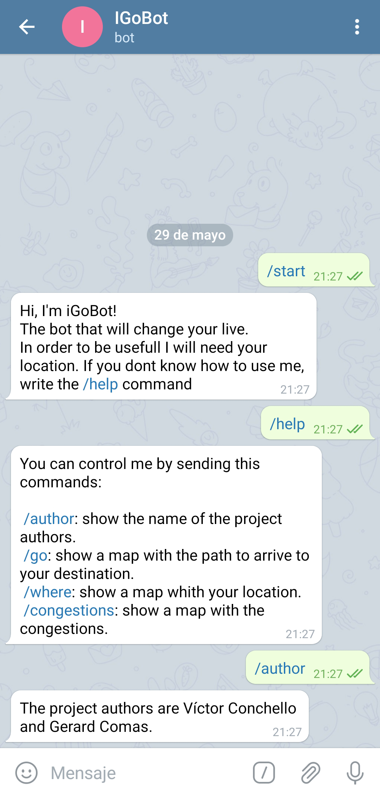
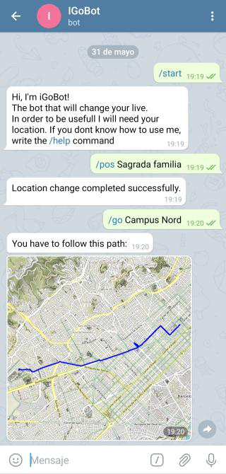
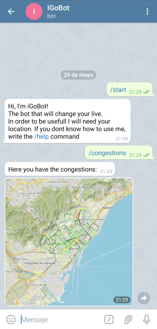
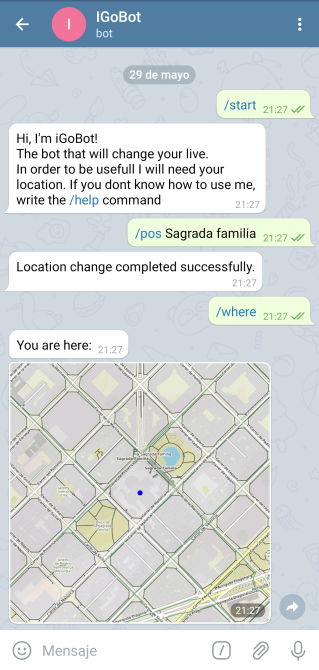

# iGo

This project's main objective is to do a Telegram bot that tells users which is the fastest route to any location of the city, having into account the traffic congestions in the current moment.

### Features of the bot

Right now, the bot has three main commands:

**go *dest*:** Get a map with the route from your location to a destination.

**where:** Get a map with your location.

**congestions:** Get a map with the traffic congestions.

Before using the first two, the user has to send their location.

There is also a hidden command, **pos *loc*,**, which fixes the current position of the user in a fake location.

### Example pictures

   

### Technologies used

All of the code is written in Python.

To run the programs in your own computer, make sure to install all the libraries from `requirements.txt`. A fast way to do it is with the command

```
pip install -r requirements.txt
```

Between others, the main libraries used are `python-telegram-bot`, to connect python with the telegram bot, `staticmap`, to get the maps in a nice format, and `OSMnx` to treat with everything related with graphs.

### Structure of the project

**iGo.py:**

`iGo.py` is the base of the bot, where all the functions related to graphs, coordinates and congestions are implemented.

**bot.py:**

`bot.py` is the code of the bot itself, it is the bridge between `iGo.py` and Telegram.

Here we can find the implementations of all the Telegram commands.

### What we learned

There were a ton of libraries and commands that we had never used that ended up being really useful in this project. We are really glad to have learned them, incrementing our habilities in doing so.

We find specially interesting the telegram library for python, which we will use for sure in future projects and we consider to be really versatile.

### Possible future improvement

One possible way to improve the project would be to add other cities where you can find the fastest routes or even upgrade it to be able to find routes between different cities.

### Authors

The authors of this project are V&#237;ctor Conchello and Gerard Comas


Grau en Ci&#232;ncia i Enginyeria de Dades

&copy; Universitat Polit&#232;cnica de Catalunya, 2021
